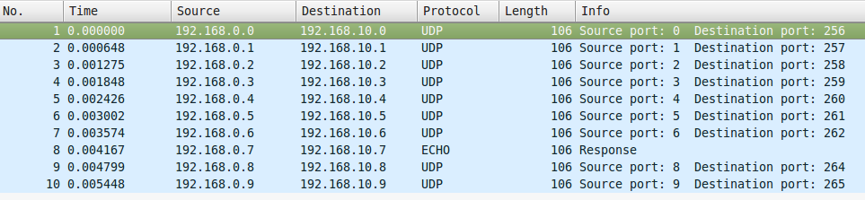

### About
This project include two task for read and write pcap writing in SystemVerilog.

### Read pcap
Read pcap task ectract packets frome file and generate dynamic array with enable signal every CLK_PAUSE clk tick.  
The count of tics is define by localparameter in task
```
localparam CLK_PAUSE = 4;
```
after receiving enable signal from task, you can extract data from array and convert to you own buss.

### Write pcap
Write pcap task has input dynamic array bus and enable signal. After receiving enable signal, task write packet in output pcap file.

### Test
Project include test for both tasks in folder ./tb. For start test, execute run_test.sh. By default the test is runing in command line mode, for gui mode change gui_enable=1 in script. In test read, task use ipv4.pcap fore reading. 


You can use your own pcap file, or generate it using scapy
```
sudo apt-get install scapy
python testPcap.py
```
